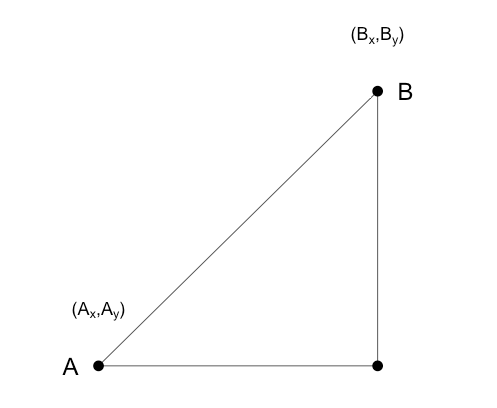

## Distance

**Distance** is defined as a value that permits us to say what animals are "close" to each other. A lot of analysis requires a good understanding of distance, especially when it comes to clustering or ML.

## Euclidean Distance
Euclidean Distance is the distance in a Euclidean space.



The distance here is just $\sqrt{(A_{x}-B_{x})^{2}+(A_{y}-B_{y})^2}$


## Distance in High Dimensions

For high dimensional data, we can't exactly rely on this method.


```{r options, echo=FALSE}
library(devtools)
install_github("genomicsclass/tissuesGeneExpression")
library(tissuesGeneExpression)
```


```{r}
data(tissuesGeneExpression)
dim(e) ##e contains the expression data
```
```{r}
table(tissue)
```

### High dimensional distance with Euclidean distance
We can that the above data contents are huge and doing distance the way we did prior may not be the best idea. If we do try to represent it with Euclidean distance, this is what distance would end up looking like:

$$
\mbox{dist}(i,j) = \sqrt{ \sum_{g=1}^{22215} (Y_{g,i}-Y_{g,j })^2 }
$$

and the distance between two features $h$ and $g$ is:

$$
\mbox{dist}(h,g) = \sqrt{ \sum_{i=1}^{189} (Y_{h,i}-Y_{g,i})^2 }
$$

### High dimensional distance with matrix algebra
The distance between samples $i$ and $j$ can be written as

$$ \mbox{dist}(i,j) = (\mathbf{Y}_i - \mathbf{Y}_j)^\top(\mathbf{Y}_i - \mathbf{Y}_j)$$

with $\mathbf{Y}_i$ and $\mathbf{Y}_j$ columns $i$ and $j$. This result can be very convenient in practice as computations can be made much faster using matrix multiplication.


## Example
Let's try to compute distance with R:
``` {r}
library(tissuesGeneExpression)
data(tissuesGeneExpression)
```
``` {r}
table(tissue)
```

``` {r}
x <- e[,1]
y <- e[,2]
z <- e[,87]

tissue[c(1,2,87)]
```
``` {r}
sqrt(sum(x-y)^2)
sqrt(sum(x-z)^2)

sqrt(crossprod(x-y))
sqrt(crossprod(x-z))
```
We can also use the function called dist which gives us distance of rows (therefore we must transpose the dataset):
``` {r}
d <- dist(t(e))
as.matrix(d)[1,2]
as.matrix(d)[1,87]
```
To visualize all the distances, we can use the image function:

``` {r}
image(as.matrix(d))
```


## Distance Reduction Motivation
An important technique is dimension reduction. Oftentimes, it's important to reduce dimensions without losing data. Sometimes, when we have high throughput experiment data, we have many genes and many samples and if we want to examine the relationship between them all, it can get quite challenging. Dimension reduction can help make it easier and help perform data exploration. 
